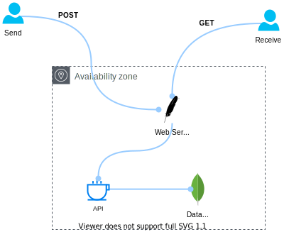

# Chatbot API
Application create for interact with users, send messages and receive messages.


## How to
For use build this project you'll need gradle and Java 11+ on your workstation. For run inside docker, you can run the command `docker build chatbot-api:latest .` and run the container with builded image.
- For Example:
```
docker build -t chatbot-api:latest .
docker run -it --rm <image-name>
```

### API Documentation
For get the endpoints and how request resources, use this URL:
```
http://localhost:8080/v1/swagger-ui/#/
```

## License
The license used for this project is MIT